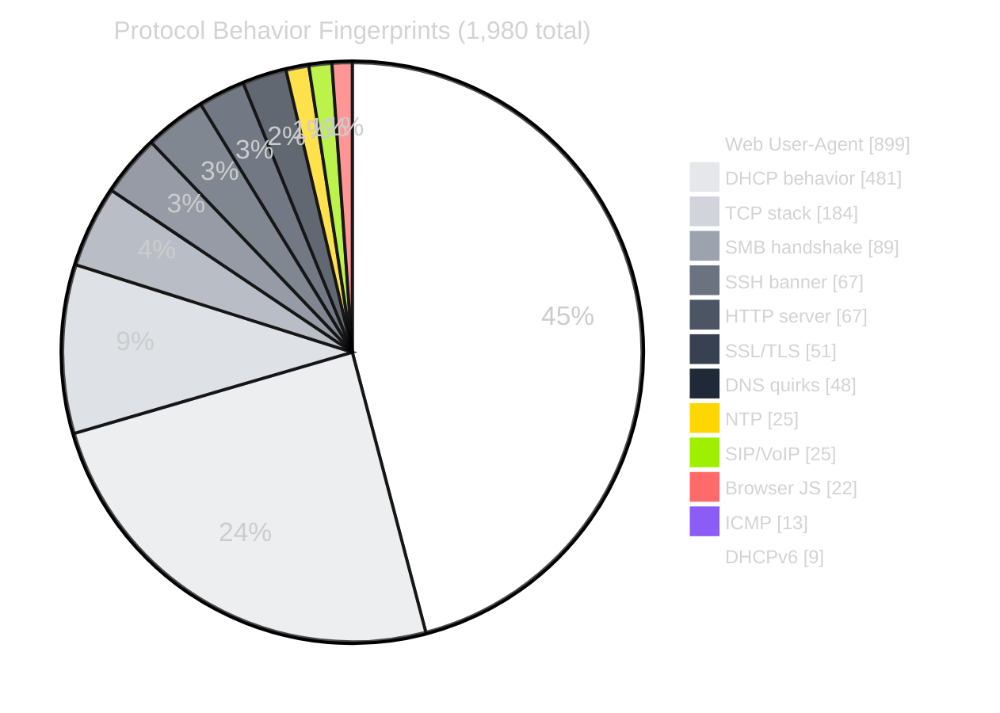
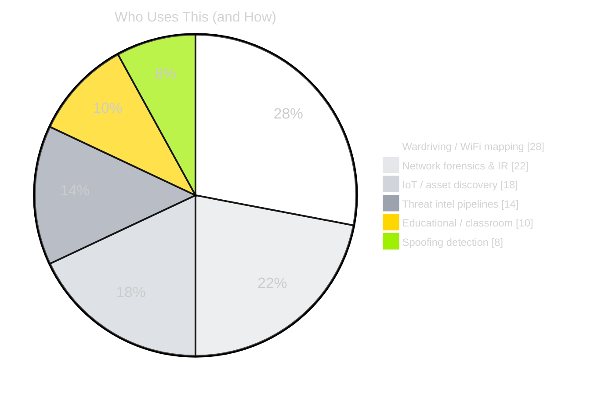

<div align="center">


`Cross-platform` `JSON` `Dataset` `Fingerprinting` - The ravens bring knowledge - Internet crowdsourced OSINT for device identification

[](https://git.io/typing-svg)

<br>

[](#-stats---live)
[](#-ls-folders)
[](#-formats)
[](#-update_schedule)
[](#-license)

[](https://github.com/Ringmast4r/Huginn-Muninn/stargazers)
[](https://github.com/Ringmast4r/Huginn-Muninn/network/members)
[](#)
[](https://github.com/Ringmast4r/Huginn-Muninn/commits/main)
[](#)


---

## `> what_is_this`

```bash
ringmast4r@github:~$ cat huginn-muninn.txt

  PURPOSE:        Device fingerprint intelligence — every layer of identification
  SCOPE:          MAC vendor + DHCP + DHCPv6 + protocol behavior signatures
  COVERAGE:       11.3M records across 8 cross-referenced datasets
  FORMATS:        CSV, JSON, Parquet, SQLite (chunked under 100MB)
  UPDATES:        First of every month via auto-pipeline
  USE CASES:      Wardriving | Network forensics | IoT discovery | Threat intel

  STATUS:         [ LIVE & AUTO-UPDATING ]
```

> In Norse mythology, **Huginn** (thought) and **Muninn** (memory) are Odin's two ravens.
> Each day they fly across Midgard, observing everything, then return to whisper all they
> have seen into the Allfather's ear. This repository is what the ravens have gathered.

Most fingerprint databases pick *one* layer of identification. Huginn & Muninn merges
all of them into a single cross-referenced knowledge base.

---

## `> stats --live`

<div align="center">

| METRIC | COUNT | NOTES |
|:------:|:-----:|:-----:|
| **MAC Vendors** | `10,233,053` | OUI + MA-M + MA-S blocks |
| **DHCP Fingerprints** | `448,002` | Option 55 parameter request patterns |
| **DHCP Vendors** | `444,126` | Option 60 vendor class strings |
| **Device Profiles** | `119,028` | Manufacturer + model + OS + category |
| **DHCPv6 Enterprise** | `58,405` | IANA enterprise identifiers |
| **DHCPv6 Fingerprints** | `1,654` | IPv6 option-list patterns |
| **Combinations** | `813` | Fingerprint → device mappings (the bridge) |
| **Web User-Agent** | `899` | User-Agent → browser/device |
| **Total Records** | `~11.3M` | Cross-referenced across 8 datasets |

</div>

---

## `> the_missing_link` — Combinations

Most fingerprint databases give you raw patterns but don't tell you *what device they belong to*.
The `Combinations/` folder bridges this gap by linking protocol fingerprints to actual devices.

```
DHCP Pattern "1,3,6,15,28,51,58,59"
        ↓
    Fingerprint ID #450
        ↓
    Device ID #9417 → "Amazon Fire OS" (eBook Reader)
```

<div align="center">

| STAT | COUNT |
|:-----|:-----:|
| Total mappings | `813` |
| Linked to device IDs | `727` |
| Protocol-only (new devices) | `86` |

</div>

---

## `> protocol_fingerprints`

The `Satori_Fingerprints/` folder identifies devices by **how they behave** at the protocol
level, not just what they self-report. A device doesn't need to tell you it's running Linux —
its TCP stack betrays it.

<div align="center">



</div>

<details>
<summary><b>Full protocol fingerprint table (13 protocols)</b></summary>

| FILE | COUNT | WHAT IT IDENTIFIES |
|:-----|:-----:|:-------------------|
| `webuseragent.json` | `899` | Browser + device from HTTP User-Agent |
| `dhcp.json` | `481` | Device name/type from DHCP behavior |
| `tcp.json` | `184` | OS from TCP stack (window, TTL, options) |
| `smb.json` | `89` | Windows version from SMB handshake |
| `ssh.json` | `67` | Server software from SSH banner |
| `web.json` | `67` | Web server from HTTP response headers |
| `ssl.json` | `51` | TLS implementation from handshake |
| `dns.json` | `48` | DNS server from query quirks |
| `ntp.json` | `25` | Device type from NTP response |
| `sip.json` | `25` | VoIP device from SIP headers |
| `browser.json` | `22` | Browser from JS execution behavior |
| `icmp.json` | `13` | OS from ICMP echo characteristics |
| `dhcpv6.json` | `9` | Device from DHCPv6 behavior |

</details>

---

## `> identification_chain`

```
┌─────────────────────────────────────────────────────────────┐
│  NETWORK TRAFFIC OBSERVED                                   │
└─────────────────────────────────────────────────────────────┘
                              ↓
┌─────────────────────────────────────────────────────────────┐
│  MAC: 00:1A:2B:XX:XX:XX                                     │
│  → MAC_Vendors/      → "Apple, Inc."                        │
└─────────────────────────────────────────────────────────────┘
                              ↓
┌─────────────────────────────────────────────────────────────┐
│  DHCP Option 55: 1,3,6,15,28,51,58,59                       │
│  → DHCP_Signatures/  → fingerprint ID #450                  │
│  → Combinations/     → "Amazon Fire OS" (eBook Reader)      │
└─────────────────────────────────────────────────────────────┘
                              ↓
┌─────────────────────────────────────────────────────────────┐
│  TCP SYN: Window=65535, TTL=64, Options=MSS,NOP,WS,NOP,NOP  │
│  → tcp.json          → "iOS 14.x"                           │
└─────────────────────────────────────────────────────────────┘
                              ↓
┌─────────────────────────────────────────────────────────────┐
│  RESULT: Apple device running iOS 14 + Amazon Fire OS app   │
└─────────────────────────────────────────────────────────────┘
```

---

## `> ls folders/`

<div align="center">

| FOLDER | WHAT IT HOLDS | RECORDS | FORMATS |
|:-------|:--------------|:-------:|:-------:|
| `MAC_Vendors/` | Hardware manufacturer identities (OUI extended) | 10.3M | csv/json/parquet/sqlite |
| `DHCP_Signatures/` | DHCP Option 55 fingerprint patterns | 457K | csv/json/parquet/sqlite |
| `DHCP_Vendors/` | DHCP Option 60 vendor class strings | 447K | csv/json/parquet/sqlite |
| `Devices/` | Full device profiles | 119K | csv/json/parquet/sqlite |
| `DHCPv6_Enterprise/` | IPv6 IANA enterprise identifiers | 58K | csv/json/parquet/sqlite |
| `DHCPv6_Signatures/` | IPv6 DHCP fingerprints | 2K | csv/json/parquet/sqlite |
| `Satori_Fingerprints/` | Protocol behavior signatures (13 protocols) | `1,980` | csv/json/sqlite/xml |

| `Combinations/` | Fingerprint → device mappings (the bridge) | `813` | csv/json/sqlite |

</div>

---

## `> formats`

Each folder ships the same data in multiple formats. Pick the one that fits your stack.

<div align="center">

| FORMAT | BEST FOR | NOTES |
|:------:|:---------|:------|
|  | Excel, pandas, quick parsing | Plain text, universal |
|  | Web apps, JavaScript, REST | Easy to load |
|  | Spark, Polars, DuckDB | Columnar, compressed |
|  | SQL queries, local DBs | Single file, queryable |

</div>

Large datasets are chunked under GitHub's **100 MB per-file limit** (e.g. `mac_vendor_part01.csv` … `mac_vendor_part11.csv`).

---

## `> usage`

### `python` — Lookup a MAC

```python
import sqlite3

conn = sqlite3.connect('MAC_Vendors/sqlite/mac_vendor_part01.db')
row = conn.execute(
    "SELECT name FROM mac_vendor WHERE mac = '9CE330'"
).fetchone()
print(row)  # → ('Cisco Systems, Inc.',)
```

### `python` — Find Device from DHCP Fingerprint

```python
import sqlite3

# 1. Get fingerprint ID
sig = sqlite3.connect('DHCP_Signatures/sqlite/dhcp_fingerprint.db')
fp_id = sig.execute(
    "SELECT id FROM dhcp_fingerprint WHERE value = '1,3,6,15,28,51,58,59'"
).fetchone()[0]

# 2. Cross-reference with combinations
comb = sqlite3.connect('Combinations/sqlite/dhcp_combinations.db')
row = comb.execute(
    "SELECT satori_name, device_type FROM dhcp_combinations WHERE dhcp_fingerprint_id = ?",
    (fp_id,)
).fetchone()
print(row)  # → ('Amazon Fire OS', 'eBook Reader')
```

### `python` — OS from TCP Behavior

```python
import json

with open('Satori_Fingerprints/json/tcp.json') as f:
    tcp_fps = json.load(f)

linux = [fp for fp in tcp_fps if 'Linux' in fp.get('os_name', '')]
print(f"{len(linux)} Linux TCP fingerprints")
```

### `node.js`

```javascript
const devices = require('./Devices/json/device.json');
const iphones = devices.filter(d => d.name.includes('iPhone'));
console.log(`${iphones.length} iPhone variants`);
```

### `duckdb` — Query Parquet directly

```sql
SELECT name, COUNT(*)
FROM 'MAC_Vendors/parquet/mac_vendor_part*.parquet'
GROUP BY name
ORDER BY 2 DESC
LIMIT 20;
```

---

## `> use_cases`



<div align="center">

| USE CASE | DATASETS YOU NEED |
|:---------|:------------------|
| **"What device is this MAC?"** | `MAC_Vendors/` |
| **"What device sent this DHCP?"** | `DHCP_Signatures/` + `Combinations/` |
| **"What OS from TCP behavior?"** | `Satori_Fingerprints/tcp.json` |
| **"Identify SSH server version"** | `Satori_Fingerprints/ssh.json` |
| **"Detect browser from User-Agent"** | `Satori_Fingerprints/webuseragent.json` |
| **"Full device profile by ID"** | `Devices/` |
| **"IPv6 device identification"** | `DHCPv6_Signatures/` + `DHCPv6_Enterprise/` |

</div>

---

## `> update_schedule`

The repo auto-updates on the **first of every month** at `03:00 UTC` via an internal pipeline.
The data is *additive* — devices don't disappear and fingerprints don't go stale fast, so
monthly refresh is the right cadence.

---

## `> related_projects`

[](https://github.com/Ringmast4r/OUI-Master-Database)
[](https://wifimothership.com/)
[](https://github.com/Ringmast4r/FLOCK)
[](https://github.com/Ringmast4r/Tower-Hunter)

---

## `> contributing`

Issues and PRs welcome. Most-wanted contributions:

- Expand the `Combinations/` bridge beyond 813 mappings (theoretical space is 42 billion)
- Add new protocol fingerprints to `Satori_Fingerprints/` (TLS JA3/JA4, QUIC, Bluetooth)
- Country-code derivation from MAC vendor address strings
- API wrapper libraries (Go, Rust, Ruby)

---

## `> license`

Released under **MIT** — use commercially, modify, redistribute, embed in proprietary tools.

---

> *"Every day Huginn and Muninn fly over the vast earth. I fear for Huginn that he may
> not return, but I fear even more for Muninn."*
> — Odin, from the Grímnismál

*Thought is valuable. Memory is irreplaceable.*

---

**Last updated:** `2026-05-12` · **Total records:** `~11.3M` · **Maintained by** [@Ringmast4r](https://github.com/Ringmast4r)


</div>
